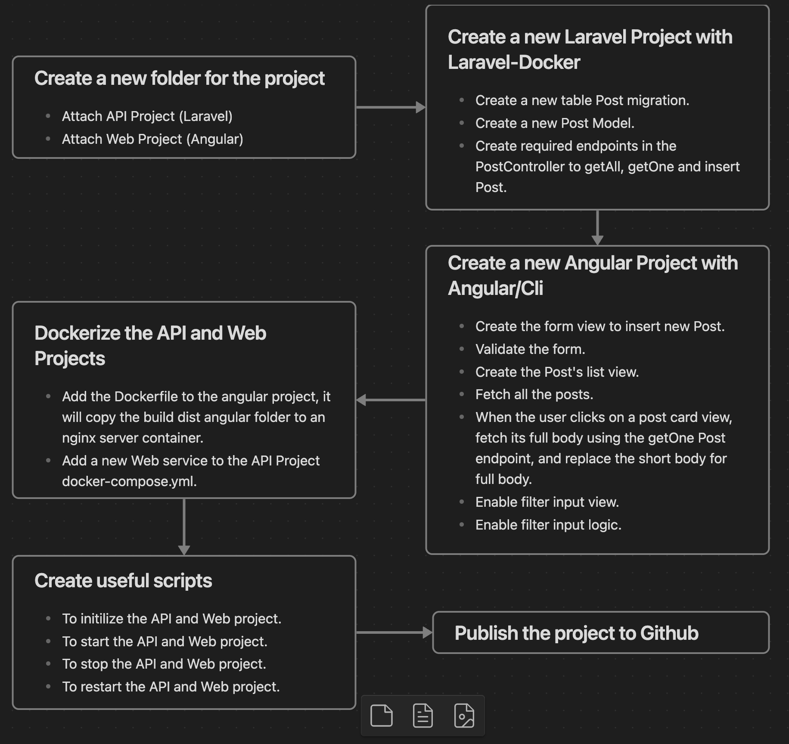

# Basic Blog - A minimalist UI/UX Web to publish and filter your posts easily.


## Table of Contents

- [Requirements](#requirements)
- [Getting Started](#getting-started)
- [Project Diagram Flow](#project-diagram-flow)

### Requirements

- [Docker](https://docs.docker.com/engine/install/#desktop)
- [Docker-Compose](https://docs.docker.com/compose/install/#scenario-one-install-docker-desktop)

### Getting Started

In order to start turn on your docker host before doing the following steps.

```
git clone git@github.com:eliu81/Basic-Blog.git
cd basic-blog
sh inith.sh
```

Then go to http://localhost to visualize the web.

### Project Diagram Flow




